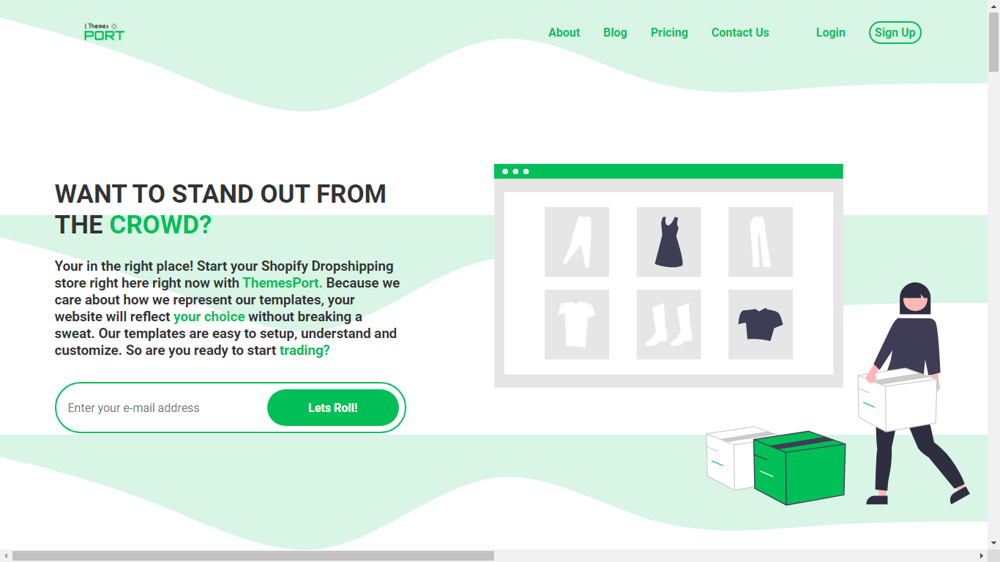

# Project Title

E-Store for Shopify Themes

## Description

The main purspose for this project was is to test my HTML and CSS skills in creating a high-end professional looking landing page for e-commerce with a touch of JavaScript magic.

## Preview


## Getting Started

### Dependencies

* HTML, CSS and Vanilla JavaScript
* Social Icons imported from FONTAWESOME
* "ThemesPort" logo is not for commercial use.
* Images such as "RedBull, "Heinz" and "The Economist" used are NOT for commercial use. I do not hold any rights for these trademarks.

### Installing

* Download all files found in this repo.

### Executing program

* Make sure to download all files mentioned above listed with the assets folder and put them in a folder
* Open VSCode and open a new workspace and add that foler you just created.
* Adjust the 'src' attirbutes to match the files location.
* Voila! Run the code and enjoy the functionality!
```
code blocks for commands
```

## Help

Any advise for common problems or issues.
```
command to run if program contains helper info
```

## Authors

Contributors names and contact info

ex. Hatem   
ex. [@codenkoffee](https://www.instagram.com/codenkoffee/)

## Version History

* 0.2
    * Various bug fixes and optimizations
    * See [commit change]() or See [release history]()
* 0.1
    * Initial Release

## License

This project's source code can be used for personal use or GitHub projects EXCEPT for the TRADEMARKS listed above.

